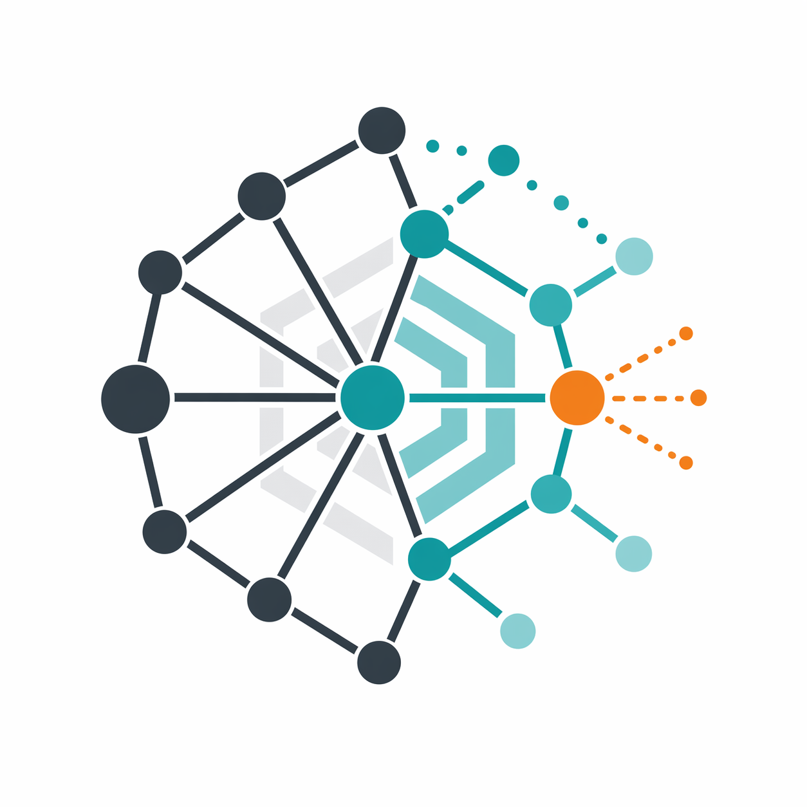

<p align="center">
  
</p>

# AbstractGraph Ecosystem

AbstractGraph is an ecosystem for treating structured phenomena as graphs that
can be decomposed, compared, learned from, repaired, and generated.

The repositories are split by semantic responsibility. Each one owns a layer of
the graph workflow, while the ecosystem gives those layers a shared vocabulary:
domain objects become attributed graphs, attributed graphs become abstract
graph structures, abstract graph structures become features and models, and
models can guide generation or repair.

For repository layout, submodule handling, editable installs, and sync rules,
see [docs/ORGANIZATION.md](docs/ORGANIZATION.md).

## Repository Roles

### [abstractgraph-graphicalizer](repos/abstractgraph-graphicalizer/README.md)

Converts raw or domain-specific data into attributed graphs.

### [abstractgraph](repos/abstractgraph/README.md)

Defines the shared abstract graph representation, operators, decomposition
semantics, serialization, hashing, vectorization, and feature extraction.

### [abstractgraph-ml](repos/abstractgraph-ml/README.md)

Learns from graph-derived representations through estimators, neural models,
feasibility analysis, importance analysis, and model selection utilities.

### [abstractgraph-generative](repos/abstractgraph-generative/README.md)

Constructs, rewrites, repairs, interpolates, and optimizes graphs using the
shared graph semantics and, when useful, learned scoring signals.

## Semantic Layers

### Domain-to-Graph Adapters

`abstractgraph-graphicalizer` is the ingestion layer.

It turns domain-specific inputs into labeled NetworkX graphs: molecules,
sequences, matrices, RNA structures, protein contact networks, segmented image
objects, attention patterns, and already graph-like data. Its role is not to
define downstream decomposition or learning semantics. Its role is to make
different sources speak the same graph language with meaningful node and edge
attributes.

This layer answers:

- What are the entities in the original object?
- What relations connect them?
- Which labels or attributes should survive into the graph world?

### Abstract Graph Semantics

`abstractgraph` is the core representation and operator layer.

It provides the common graph abstraction used by the rest of the ecosystem:
graph labels, operators, decompositions, complements, combinations,
serialization, hashing, vectorization, feature subgraphs, and display helpers.
It is the place where graph structure becomes something that can be manipulated
compositionally rather than only stored as an adjacency relation.

This layer answers:

- What does it mean to decompose a graph?
- Which transformations preserve useful structure?
- How can graph fragments be named, hashed, serialized, compared, or turned
  into vectors?

### Learning Over Graph Structure

`abstractgraph-ml` is the estimation and analysis layer.

It consumes graph-derived representations from `abstractgraph` and turns them
into predictive or diagnostic machinery: estimators, neural models,
feasibility analysis, importance scoring, top-k selection, and model-facing
utilities. Its purpose is to ask which graph components matter, whether a
target is learnable from available graph features, and how graph structure can
support supervised or unsupervised tasks.

This layer answers:

- Which graph-derived features predict a property?
- Which decomposed components are important?
- Is a feature set or representation feasible for the task?
- Which models or ranked graph components should be selected?

### Generation, Repair, and Search

`abstractgraph-generative` is the constructive layer.

It uses the graph semantics and learning machinery to build or modify graphs:
rewriting, autoregressive generation, conditional generation, interpolation,
optimization, and repair. It closes the loop from analysis back to construction:
learned signals can guide which graph edits to make, while graph operators
provide the space in which edits and generated objects remain meaningful.

This layer answers:

- How can a graph be repaired while preserving constraints?
- How can new graph structures be generated conditionally?
- How can one graph be interpolated toward another?
- How can learned objectives guide graph search or optimization?

## How They Work Together

The ecosystem can be read as a semantic pipeline:

```text
domain object
  -> graphicalized graph
  -> abstract graph structure
  -> decomposition, features, and vectors
  -> estimation, feasibility, and importance
  -> generation, interpolation, optimization, or repair
```

The pipeline is not strictly one-way. The generative layer can call back into
the learning layer for scoring, the learning layer depends on stable abstract
graph semantics, and graphicalizers can be used again to validate or reinterpret
generated objects in their original domain.

## Dependency Meaning

The dependency direction follows the semantic layering:

- `abstractgraph-graphicalizer` can stand alone because it only needs to
  produce ordinary attributed graphs.
- `abstractgraph` is the shared semantic core.
- `abstractgraph-ml` depends on `abstractgraph` because learning operates over
  abstract graph features and decompositions.
- `abstractgraph-generative` depends on `abstractgraph` and `abstractgraph-ml`
  because generation needs graph operations and can use learned objectives.

In practice, `abstractgraph-graphicalizer` prepares inputs, `abstractgraph`
defines what can be done with those inputs as graphs, `abstractgraph-ml`
evaluates and learns from the resulting structures, and
`abstractgraph-generative` uses those semantics to create or improve structures.
